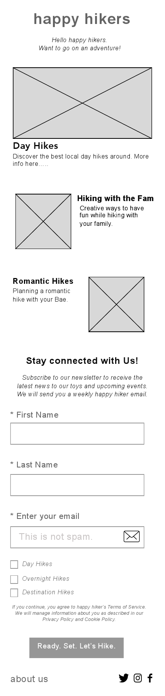
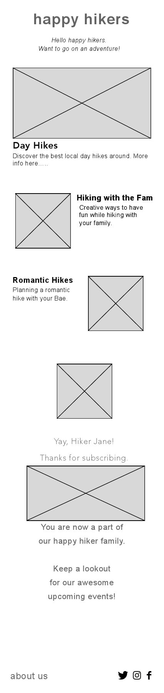
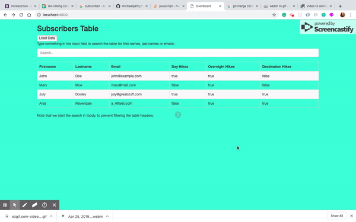

# Happy Hikers

This app ....

[Link to project hosted on Heroku](https://hikingcollab.herokuapp.com/)

---

## User and Business Stories
---
_A user  should be able to:_
1. User can subscribed to the newsletter
2. A user won't get get email spam
3. A user can  enter personal information as quickly and easily 

_A business should be able to:_
1. As the business can see the data being collected from newsletter sign-ups on an account dashboard
2.  As the business always can see first-name, last-name and email from newsletter sign-ups on an account dashboard

## Wireframes
---

## Technologies Used
---
* HTML/CSS
* Bootstrap
* JQuery
* Javascript
* Node.js/Express.js 
* MongoDB 
* Heroku
* Github
* Google
* Screencastify
* Whiteboards
* Instructors & Peers

## Planned Features
---
Add:
* Admin will be able to  Login. 
* A user can determine exactly which newsletter topics to receive.
* A user can determine how frequently to receive these email newsleters.

---

##### Screenshot

